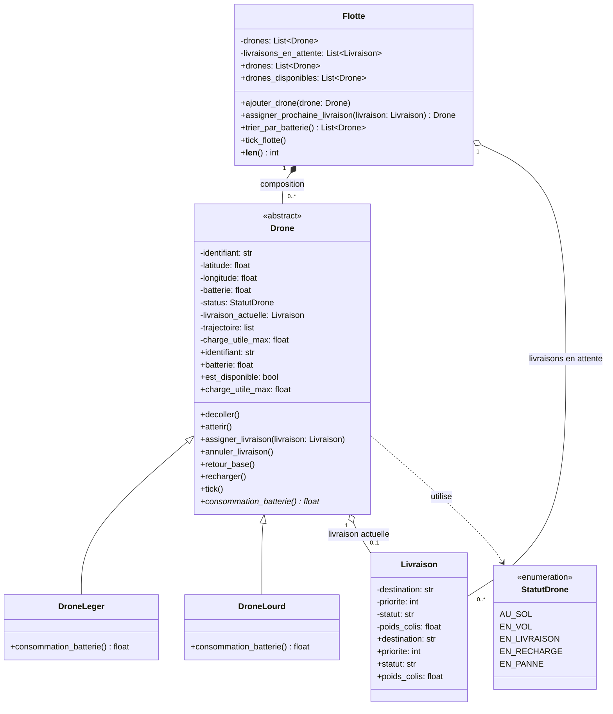

# Laboratoire révision Python POO : Surveillance de drones

## Objectifs pédagogiques
- Organiser un projet Python en package (`__init__.py`, imports relatifs)
- Créer des classes et modéliser leurs relations (composition, agrégation)
- Concevoir une hiérarchie de classes (héritage, classe/méthodes abstraites)
- Utiliser l'encapsulation (attributs protégés, `@property`, setters et validations)
- Représenter un ensemble d'états fixes avec une énumération (`Enum`)
- Implémenter les méthodes spéciales `__init__`, `__str__`, `__repr__`, `__len__`
- Utiliser une fonction lambda.
- Utiliser des annotations de types (type hints)
- etc.

## Arborescence
```
SurveillanceDrones/
├── drones/
│   ├── __init__.py
│   ├── statut_drone.py
│   ├── livraison.py
│   ├── drone.py
│   ├── drone_leger.py
│   ├── drone_lourd.py
│   └── flotte.py
├── main.py
└── requirements.txt
```

## Mise en situation
Une compagnie exploite une flotte de drones autonomes pour livrer de petits colis en zone urbaine. Une flotte regroupe plusieurs drones. Elle reçoit des demandes de livraison qu'elle assigne à un drone disponible ; une livraison non prise en charge est mise en attente.

Il existe deux types de drones : les drones légers, conçus pour des colis légers, avec une consommation de batterie constante ; et les drones lourds, conçus pour des colis volumineux, dont la consommation augmente avec le poids du colis transporté.

## Fonctionnement attendu

### Drone
- États possibles : au sol, en vol, en livraison, en recharge, en panne
- Chaque action (décoller, atterrir, assigner une livraison, l'annuler, retourner à la base, recharger) n'est acceptée que si l'état actuel le permet
- Disponible pour une livraison seulement s'il est au sol et que sa batterie dépasse 15 %
- Ne transporte jamais plus d'une livraison à la fois
- Sa batterie évolue seule dans le temps (tick): diminue en vol/livraison, se régénère en recharge
- Doit respecter les contraintes physiques de son type (autonomie, charge utile)

### Livraison
- Suit un cycle de vie via son statut : en attente, assignée, livrée ou annulée
- Peut être annulée par le drone auquel elle est assignée, ou si celui-ci retourne à la base avant d'avoir terminé

### Flotte
- Assigne automatiquement chaque nouvelle livraison au drone disponible ayant le plus de batterie et pouvant transporter le colis; si aucun drone n'est disponible, la livraison est mise en attente.
- `len(flotte)` retourne le nombre de drones qu'elle contient (redéfinir __len__).
- Fait avancer la simulation pour tous ses drones en même temps (un « tick » global)
- Doit avoir une méthode `trier_par_batterie` qui retourne la liste des drones triés par ordre décroissant de batterie, en utilisant une fonction lambda

## Question 1
Créer votre diagramme de classes et le comparer au diagramme proposé.

## Question 2

## Exemple d'exécution
1. Créer une `Flotte`
2. Créer au moins un `DroneLeger` et un `DroneLourd` avec des coordonnées GPS réalistes, et les ajouter à la flotte
3. Créer une `Livraison` et l'assigner via `assigner_prochaine_livraison`
4. Afficher le nombre de drones de la flotte (`len(flotte)`) et la liste des drones disponibles
5. Afficher la flotte triée par batterie (`trier_par_batterie`)
6. Simuler plusieurs cycles (`tick_flotte()`) et afficher l'évolution de l'état/batterie des drones entre chaque cycle
7. Déclencher volontairement une commande invalide (ex. décoller un drone déjà en vol) et l'intercepter avec un `try/except` pour afficher un message d'erreur clair

